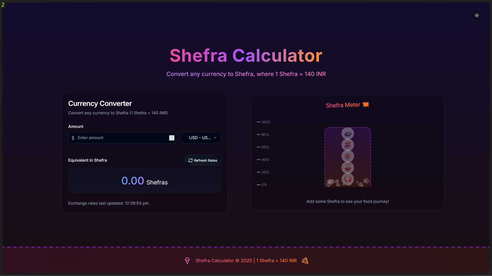

# 🍚 Shefra Calculator 💰

A fun web application built with React and TypeScript that calculates the equivalent value of a given amount in a fictional currency called "Shefra" (Shezwan Fired Rice).



## Overview

The Shefra Calculator 🧮 allows you to input a price in various real-world currencies and instantly see how many "Shefras" you can get for that amount. 1 Shefra is defined as equal to 140 Indian Rupees (INR ₹). The app also features live currency conversion 🔄, suggestions for things you could buy with your Shefras 🤔, and a dark mode 🌙.

## Key Features

* 🍚 **Shefra Conversion:** Easily convert any amount to the fictional "Shefra" currency.
* 🌎 **Multi-Currency Support:** Choose from a variety of real-world currencies for input.
* 📈 **Live Exchange Rates:** Fetches real-time currency exchange rates from an API.
* 💡 **Fun Equivalents:** Discover interesting things you could potentially buy with your calculated Shefra amount.
* ✨ **Elegant Design:** A clean and modern user interface inspired by Apple's design principles.
* ✍️ **Typewriter/Gradient Title:** A stylish and engaging title for the application.
* 🌙 **Dark Mode:** Toggle between a light and dark theme for comfortable viewing.

## Tech Stack

* ⚛️ **React:** A JavaScript library for building user interfaces.
* 🟦 **TypeScript:** A strongly typed superset of JavaScript.
* [Add any other relevant libraries/dependencies here, e.g., an API fetching library like Axios 🚀, a styling library like Styled Components 💅 or Tailwind CSS <0xF0><0x9F><0xAA><0x9E>, etc.]

## Installation

1.  ⬇️ **Clone the repository:**
    ```bash
    git clone [Your Repository URL]
    ```

2.  📂 **Navigate to the project directory:**
    ```bash
    cd shefra-calculator
    ```

3.  📦 **Install dependencies:**
    ```bash
    npm install  # or yarn install
    ```

## Usage

1.  🚀 **Start the development server:**
    ```bash
    npm run dev  # or yarn dev
    ```

2.  🌐 Open your browser and navigate to `http://localhost:3000` (or the port specified in your terminal).

3.  ⌨️ Enter a price in the input field.
4.  💰 Select your desired currency from the dropdown.
5.  🔄 The app will automatically fetch the exchange rate, convert the price to INR, and then calculate the equivalent amount in Shefras.
6.  🤔 Explore the fun suggestions of what you can buy with your Shefras and toggle the dark mode 🌙 if you prefer.

## Contributing

[Optional: Add your contributing guidelines here. For example:]

🤝 Contributions are welcome! If you'd like to contribute to this project, please follow these steps:

1.  🍴 Fork the repository.
2.  🌿 Create a new branch for your feature or bug fix.
3.  ✍️ Make your changes and commit them.
4.  ⬆️ Push your changes to your fork.
5.  Pull Request: 📤 Submit a pull request.

## License

[Optional: Add your license information here. For example:]

📄 This project is licensed under the MIT License. See the `LICENSE` file for more details.

## Deployment

[Optional: Briefly describe how to deploy the application. For example, if you used Netlify or Vercel:]

☁️ This application can be easily deployed using platforms like Netlify or Vercel by connecting your GitHub repository to their services.

## Screenshots

[Optional: Add more screenshots showcasing different aspects of the application, like dark mode.] 📸

## Contact

[Optional: Add your contact information or links to your social media profiles.] 📧
